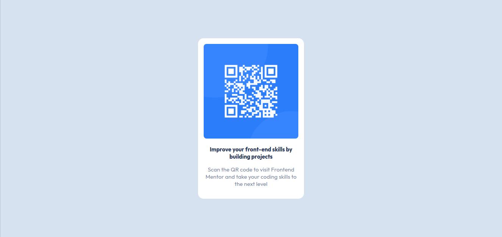

# Frontend Mentor - QR code component solution

This is a solution to the [QR code component challenge on Frontend Mentor](https://www.frontendmentor.io/challenges/qr-code-component-iux_sIO_H).

## Table of contents

- [Screenshot](#screenshot)
- [Links](#links)

### Screenshot

### Links

- Solution URL: [Add solution URL here](https://github.com/git-0r/qr-code-component-main)
- Live Site URL: [Add live site URL here](https://qr-code-component-main-egqvri2vl-git-0r.vercel.app/)
